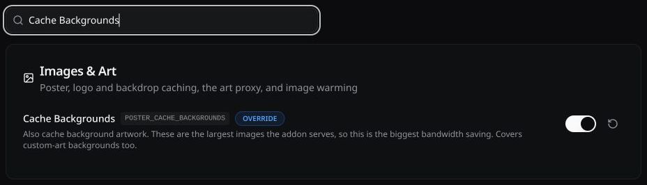
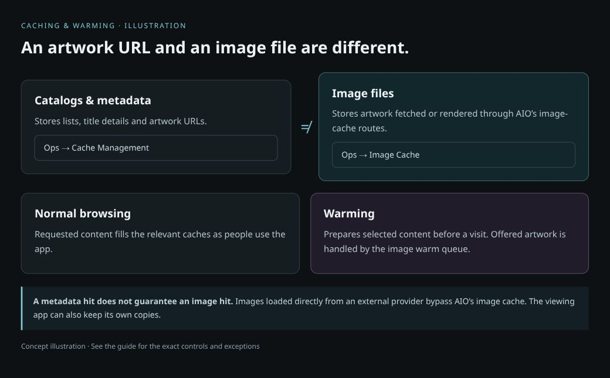
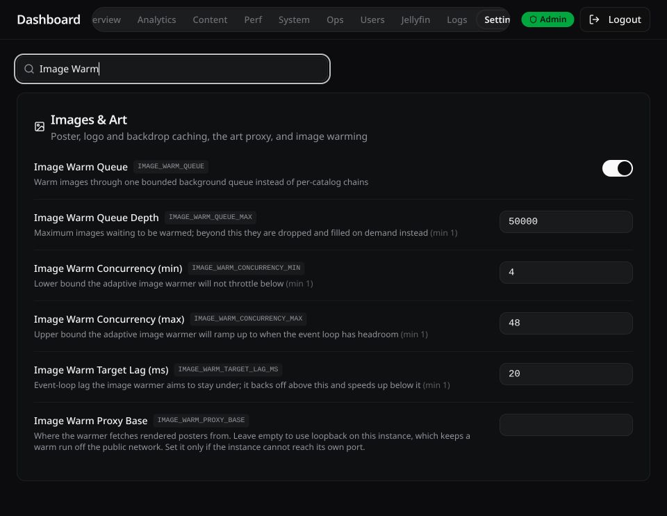
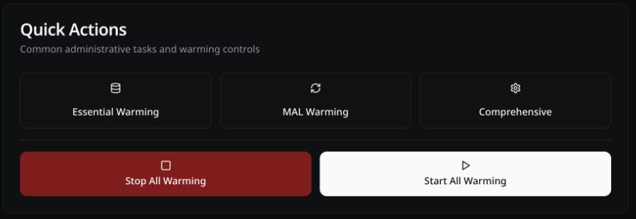

# Caching & Warming Guide

Cache images for faster repeat visits, then warm selected content ahead of time. Start small and increase coverage only when the results justify the extra requests and storage.

## Recommended starting setup

Start with caching, then add warming only if first visits need it. Keep settings that already work well. Expand the reference below to compare upstream defaults with suggested values.

1. Enable the image cache and the artwork classes you use in **Dashboard → Settings → Images & Art**.
2. [Save and verify the changes](#save-and-verify-settings), including any required restart.
3. Browse normally and check **Ops → Image Cache** before adding a full warm.
4. If first visits still need preparation, follow [Warming modes](#warming-modes) and run one limited test.
5. Use the [problem-to-setting table](#which-setting-should-i-check) before increasing limits.

### Defaults and suggested values

| Setting | Upstream default | Suggested first setup |
|---|---|---|
| Built-in Image Cache | Off | On, with persistent storage; restart after saving. |
| Cache Backgrounds / Landscape Posters / Logos | Off | On for artwork your client displays. |
| Cache Collection Images | On | Keep on if collection artwork uses the cache. |
| Cache Processed Images | On | Keep on to avoid repeating image rendering. |
| Cache Episode Thumbnails | Off | Leave off initially; enable if episode browsing benefits. |
| Image Cache Max Size | `10g` | Start at `10g`; consider `25g`–`50g` only when near capacity and disk space permits. |
| Image Cache Memory Size | `128m` | Keep `128m` initially. |
| Prefer Smaller TMDB Posters | On | Keep on. |
| Prefer Smaller TMDB Logos / Landscape Posters | Off | Try on and check display quality. |
| Prefer Smaller TMDB Backdrops | Off | Keep off for full-resolution backgrounds. |
| Warmup Mode | `essential` | Keep essential for a light start; choose comprehensive for selected saved catalogs. |
| Max Pages Per Catalog | `100` | If using comprehensive, test `3` pages first. This is our suggestion, not the default. |
| Warmup Interval (hrs) | `24` | Keep `24` for comprehensive warming and set Catalog Cache TTL (`CATALOG_TTL`) to `86400` seconds. |
| Image Warm Concurrency (min / max) | `4` / `48` | Keep initially; try a maximum of `24` only if warming affects browsing. |

## Choose your setup

Choose the closest match, then use the linked steps. You can expand coverage later without starting over.

| Your setup | Start with | Next step |
|---|---|---|
| Normal browsing or a small household | Enable caching for the artwork you use. Let browsing fill it; a full catalog warm is optional. | Follow [Recommended starting setup](#recommended-starting-setup). |
| Selected catalogs should load quickly on the first visit | Use comprehensive warming for a saved configuration, starting with three pages per catalog. It warms eligible catalogs in that configuration, not just the folder currently open. | Follow [Comprehensive mode](#b-warm-your-own-catalogs-with-comprehensive-mode). |
| A shared server with many users | Start with on-demand caching and essential/popular warming for shared content. Keep comprehensive coverage limited to representative configurations; the current UUID control accepts at most five. | Compare [Warming modes](#warming-modes), then monitor provider errors, disk use and responsiveness before expanding. |

A larger server does not need every warmer enabled. Choose work that people will reuse, and keep enough capacity for normal browsing while it runs.

## Which setting should I check?

| What you notice | Check first | Change only if needed |
|---|---|---|
| Slow first load, fast second load | Was the image already cached? Is the provider slow? | Warm the catalogs people use; try smaller tile artwork. More RAM cannot speed up every upstream fetch. |
| Slow repeat loads | Are images actually served through AIO, and is its cache persistent and enabled? | Enable the relevant cache class or fix the image route/storage. Check capacity and expiry before increasing RAM. |
| Browsing slows during warming | Event-loop delay, provider errors and warm size | Reduce Max Pages Per Catalog or Image Warm Concurrency (max); use quiet hours to protect browsing time. |
| Cache full / over capacity | Ops → Image Cache disk usage versus budget | Increase Image Cache Max Size if disk space permits, or reduce warmed artwork. Queue depth does not fix a full disk budget. |
| Queue full / dropped work | How much artwork was offered at once? | Reduce page coverage or configurations per run before increasing queue depth. |
| Old ratings or artwork | Provider freshness rules and the player's own cache | Refresh the affected image or adjust that provider's policy; do not clear everything. |
| Warming never starts | Mode, saved UUIDs, quiet hours, restart notices and logs | Correct the named configuration issue rather than repeatedly pressing Force. |

## Save and verify settings

Use the search box in **Dashboard → Settings** to find a setting by its name or environment key. The screenshot shows a filtered setting; its value is an example, not a list of required changes.

The dashboard saves individual settings. It is separate from saving a user's addon configuration.

| Control | How to save | What confirms it |
|---|---|---|
| On/off switch or dropdown | Changing it submits the update immediately. | Wait for the setting's updated message. |
| Text or number field | Edit the value, then click the save icon that appears beside it, or press Enter. | Wait for the updated message; typing alone is not a saved change. |
| Tag list, such as Warmup UUIDs | Add the entries, then use the row's save icon. | Check that the saved list remains after reloading Settings. |
| A control marked ENV ONLY | Change its environment value in your deployment. | Recreate/restart the container as required by that deployment, then verify the value. |

**An OVERRIDE badge means a saved override, not a speed improvement.** If an update fails validation, read the error and correct the value. Reload Settings and confirm your changes persisted before testing performance.

### Which changes need a restart?

Follow the **RESTART** badge and pending-restart notice in your installed version. In the checked settings, **Built-in Image Cache**, **Image Cache Directory**, **Enable Cache Warming**, **Warming Interval (min)** and **Popular Warming Interval (hrs)** require a restart. Group those edits and restart once, at a suitable time for your users.

Image-class switches, disk/RAM budgets, smaller-TMDB options and most comprehensive/image-queue controls are not marked restart-required in the checked registry. That does not make every change visible instantly: existing metadata can still contain old image URLs, and a running task may already have work queued.

After the restart, confirm the dashboard returns, the intended values remain saved, and **Ops → Image Cache** shows the cache. Test one folder twice. For warming, check that the task starts, progress advances and failures are not accumulating. If it is still waiting, check its initial delay, mode and quiet hours.

## Image caching

**Caching stores images after they are fetched or rendered. Warming fetches content ahead of a visit.** You can use the image cache without running a full warming job: normal browsing fills it as images are requested through AIO's cache routes.

| What is cached? | What it saves | Where to look |
|---|---|---|
| Catalogs and metadata | Repeated provider lookups for lists, titles and artwork URLs. | Dashboard → Ops → Cache Management |
| Image files | Downloading or rendering the same poster, logo or background again. | Dashboard → Ops → Image Cache |
| Hot images in RAM | Disk reads for frequently requested images eligible for the memory cache. | Settings → Images & Art → Image Cache Memory Size |
| Images on the viewing device | Repeated transfers between the player and the image server. | Art proxy client-cache and provider-policy settings |

A metadata cache hit does not mean the image file is cached. An image loaded directly from an external provider also does not automatically pass through AIO's image cache.

### A. Turn on the cache and choose what it stores

1. Open **Dashboard → Settings → Images & Art**. Use the settings search if a control is hard to find.
2. Enable **Built-in Image Cache**. This setting is marked **Restart**; restart the AIO container after applying it.
3. Enable the artwork classes you use, using the table below.
4. Check **Image Cache Max Size** against available storage. Keep the cache on a persistent volume; an SSD is preferable for frequent image access.
5. Browse a few titles, then open **Ops → Image Cache**. Check that the image count and disk usage increase.

| Setting | Suggested starting point | Why / trade-off |
|---|---|---|
| Built-in Image Cache | On | Stores images served through the built-in cache. Posters are included by default. |
| Cache Backgrounds | On if you display backgrounds | Avoids repeatedly downloading large artwork. Uses more disk space. |
| Cache Landscape Posters | On if your client uses landscape tiles | Helps repeat visits to those rows. |
| Cache Logos | On if logos are shown | Saves repeated logo downloads. Creates many small files. |
| Cache Collection Images | On if you use collection artwork through the cache | Stores collection covers, backdrops, logos and focus GIFs without poster reshaping. |
| Cache Processed Images | On | Avoids repeatedly rendering rating overlays and image transforms. |
| Cache Episode Thumbnails | Optional | Useful for frequent episode browsing, but long series can add hundreds of files. |
| Bring Posters to 2:3 | Leave enabled unless you need another behavior | Normalizes poster shapes. This is a presentation setting, not a reason to increase concurrency. |

For collection exports, **Serve images through this server** routes the exported artwork through AIO's cache. The viewing device must be able to reach the server. **Poster Proxy URL** normally stays blank when using the built-in cache; it is for an external caching proxy.

### B. Choose sensible storage and image sizes

These are starting points, not requirements for every server. Check free space, other applications and actual cache use before increasing limits.

| Setting | What to change | When to change it |
|---|---|---|
| Image Cache Max Size | Keep the default `10g` for a small setup; consider `25g` or `50g` on an SSD with room. | Raise it when the cache stays near its budget or warming reports over capacity. More space helps retain images; it does not make a provider respond faster. |
| Image Cache Memory Size | Start at the default `128m`; consider `512m` or `1g` only with RAM headroom and a measured need. | This is an additional RAM allowance, not the total disk cache. A large server does not automatically need a tens-of-gigabytes allocation. |
| Prefer Smaller TMDB Posters | On | Uses a 600×900 rendition rather than the original. |
| Prefer Smaller TMDB Logos | On, then check the result on your display | Uses `w500` logos. Reduces transfer sizes, with a possible loss of detail at large display sizes. |
| Prefer Smaller TMDB Landscape Posters | On for ordinary catalog tiles | Uses `w780` artwork; check quality if your client displays it much larger. |
| Prefer Smaller TMDB Backdrops | Leave off for full-resolution backgrounds; enable for lower bandwidth | Uses `w1280`. Large and 4K displays may show softer backgrounds. |

The smaller-image options affect **TMDB** artwork, not every provider. Existing metadata can keep its old artwork URLs until refreshed. Let it expire naturally, or refresh a specific affected item; clearing every cache creates a new burst of downloads.

### C. Keep artwork fresh without unnecessary downloads

**Use Built-In Provider Policies** is a good starting point. Providers serving changing rating posters may need different expiry rules from providers serving stable artwork.

- **Image Cache Validity (Days)** supplies the general freshness period where no provider policy applies. Start with `30`; longer is not always better for changing artwork.
- **Image Cache Inactive Days** removes images that have not been requested recently. Start with `30`, then adjust to your storage budget and browsing habits.
- **Art Proxy Client Cache (Days)** affects how long a player/browser can keep art. Leave it at `1` initially; provider rules can override it.
- **Follow Each Source's Own Validity** and **Art Proxy Follows the Source's Cache-Control** are different controls. Leave their defaults unless you specifically want upstream headers to govern caching.
- **Per-Provider Cache Policies**, also accessible through **Ops → Image Cache → Advanced…**, let you customize a particular provider without changing every image's lifetime.

Do not set every lifetime to “forever” to chase speed. You may keep old ratings or artwork long after the source changes.

## Warming modes

Start with the content people actually browse. Warming spends provider requests, bandwidth, disk writes and sometimes CPU before anyone opens the item. It is useful when that work will be reused.

| Mode or task | What it prepares | Best use |
|---|---|---|
| Normal browsing, without a full warm | Requested catalogs, metadata and images fill their respective caches as needed. | Small or infrequently used setups; minimal speculative work. |
| Essential warming | A small set of shared essentials, such as genres, studios and popular catalog data. | A light background baseline. |
| TMDB popular warming | Popular/trending content and related metadata. | Broad discovery browsing rather than a particular user's complete list setup. |
| Comprehensive warming | Eligible configured catalogs for the selected saved configurations, up to a page limit. Discovered artwork can be sent to the image warmer. | Regularly used collections and lists that should be prepared ahead of time. |
| MAL warming | MAL catalog tasks, with optional priority genres, decades and seasonal/schedule coverage. | Setups that use MAL anime catalogs and have working provider access. |
| Image warm queue | Downloads or renders offered artwork in the background. | Supports image preparation; it is not a separate scan of every movie or show in existence. |

**Warmup Mode** offers `essential` and `comprehensive`. In comprehensive mode, the separate TMDB popular-content and MAL warmers are skipped because comprehensive warming already covers eligible catalogs from those sources in your selected configurations. You do not need to enable the separate warmers for that same content. The small essential-cache task is separate from the TMDB popular-content pass.

### A. Start with essential and popular warming

Open **Settings → Warming: Popular**:

| Setting | Starting point |
|---|---|
| Enable Cache Warming | On for automatic essential warming. Restart if the dashboard marks the change as requiring it. |
| Warming Interval (min) | `720` — every 12 hours. |
| TMDB Popular Warming | Enable if popular TMDB content is useful to your users. |
| Popular Warming Interval (hrs) | `24`. |
| Warming Language | Match the language you normally browse, such as `en-US`. |

Popular warming needs server-side TMDB access. A personal key in a saved user configuration is not necessarily the key used by the shared popular warmer. Check the logs if the task reports that it has no TMDB key.

### B. Warm your own catalogs with comprehensive mode

Open **Settings → Warming: Full**:

1. Set **Warmup Mode** to `comprehensive`.
2. Enter your saved configuration UUID in **Warmup UUIDs**. Use your own configuration identifier, not a provider API key. The current settings accept up to five UUIDs; keep these identifiers private.
3. Set **Max Pages Per Catalog** to a modest starting value such as `3`. This is a suggested first test, not the application's default of `100`.
4. Keep **Warmup Interval (hrs)** at `24` and set **Catalog Cache TTL (`CATALOG_TTL`)** to `86400` seconds. Keep **Initial Delay (sec)** at `300` and **Task Delay (ms)** at `100` initially.
5. Leave **Resume on Restart** enabled. Apply the settings and follow any restart notice shown by your version.
6. Open **Ops**, find **Comprehensive Catalog Warming**, and start one run using its **Force** control or the **Comprehensive** quick action.
7. Watch progress and image capacity before increasing the page limit or adding more configurations.

**A page limit is not a title count.** Page sizes vary by provider. Even three pages per catalog can be substantial when a configuration contains hundreds of catalogs.

Comprehensive does not mean literally every catalog: the current implementation excludes some dynamic catalogs, such as Up Next and recommendations, and catalogs with caching disabled. It also handles sources behind merged catalogs rather than simply warming the merged wrapper.

Keep **Warmup TTL Lead (sec)** at `60` initially. It helps warmed catalog entries expire shortly before the next run so the next pass can refresh them. Leave **Auto on Cache Epoch Change** off unless you intentionally want a new full run after invalidating the metadata cache namespace.

The minimum comprehensive warming interval is **12 hours** in the checked version. Set **Catalog Cache TTL (`CATALOG_TTL`)** to the same duration in **seconds**: `43200` for 12 hours, or `86400` for 24 hours. A shorter TTL can let catalogs expire before the next run—for example, an 18-hour TTL with a 24-hour interval leaves a six-hour gap in scheduled warming coverage. Requests during that gap may need to rebuild expired pages.

After changing these settings, the next scheduled warming cycle should bring warmed entries into alignment. You do not normally need to use **Sync TTL** or **Force** just to apply an interval change.

### C. Use quiet hours correctly

**Quiet hours are a period when warming pauses or skips starting, not a window when it runs.** For example, `18:00-23:00` protects evening browsing by keeping the comprehensive warmer quiet during those hours.

Enable **Quiet Hours Enabled** and set **Quiet Hours Range** to the time you want to protect. The comprehensive warmer reads the server/container's local clock, so check its timezone. Quiet hours are not a precise “start at this time” scheduler, and already queued image work may still need to finish.

### D. Enable MAL warming only when you need it

Under **Warming: MAL**, enable **MAL Warmup Enabled** only if you use MAL catalogs and provider requests are succeeding. This warmer runs in `essential` mode.

Start with **MAL Warmup Interval (hrs)** at `24`, **MAL Initial Delay (sec)** at `300`, and **MAL Task Delay (ms)** at `100`. Use **MAL Warmup Decades**, **MAL Priority Pages**, and the priority/schedule switches to limit the content being prepared. Keep safe-for-work filtering aligned with the intended audience.

If MAL requests are failing or rate-limited, warming more frequently will not fix provider access. Resolve the errors first. Its separate **MAL Quiet Hours** controls protect time in the same way: they stop work during the selected period.

### E. Tune image warming separately

Return to **Settings → Images & Art**:

| Setting | Starting point / action | Why |
|---|---|---|
| Image Warm Queue | On | Uses one bounded queue for offered artwork. |
| Image Warm Queue Depth | Keep `50000` initially | A larger backlog is not the same as faster downloads. Work dropped from a full queue can be filled on demand. |
| Image Warm Concurrency (min) | Keep `4` initially | Lower bound for the adaptive warmer. |
| Image Warm Concurrency (max) | Keep the default `48` if browsing stays responsive; try `24` if it slows during warming | Reducing background work can improve foreground responsiveness, but the warm takes longer. These values are not universal hardware targets. |
| Image Warm Target Lag (ms) | Keep `20` | Lets the warmer back off when the event loop is busy. |
| Image Fetch Concurrency | Keep its existing/default value initially | Controls simultaneous uncached downloads. Increasing it can overload providers or your connection. |
| Image Warm Proxy Base | Normally blank | Lets rendered-image warming use the instance's loopback address. |
| Log Every Image Request | Off except for short debugging sessions | Avoids excessive logging during bulk image activity. |

Leave connection-pool, TLS-session, scan-concurrency and stream-threshold settings at their defaults unless measurements identify a problem they address. More cores and RAM do not remove provider rate limits or network bottlenecks.

### Find the image queue controls

Search for **Image Warm** in Dashboard → Settings to see the queue and concurrency controls together. These example values match the application defaults listed above.

## Progress and troubleshooting

Use **Dashboard → Ops** for cache sizes and warming progress. Use **System** for memory and event-loop delay, and **Logs** for the reason a request failed. Do not confuse the metadata/Redis hit rate with the image cache's effectiveness.

### Images, Sync TTL and Force

These buttons belong to **Ops → Maintenance Tasks → Comprehensive Catalog Warming**. Other tasks also have a Force button, which runs that particular task.

| Button | What it does | When to use it |
|---|---|---|
| **Images** | Walks the configured catalogs and offers their artwork to the image warmer while leaving the catalog warming schedule unchanged. Fresh catalog pages can be reused; missing or expired pages may still require provider calls. | After enabling another image class or when you want to prepare artwork without moving the next catalog run. |
| **Sync TTL** | Shortens catalog cache lifetimes that extend beyond the next scheduled warm, so those entries can be rebuilt when that run occurs. It does not download images or start a warm. | After adding and warming a catalog midway through the current interval, to align its expiry with the next scheduled run. |
| **Force** | Starts a comprehensive pass now, bypassing the normal interval check. It records a new run for scheduling, but can still reuse fresh catalog pages. It does not mean “clear everything and fetch it again.” | When you want a catalog warming pass now instead of waiting for the scheduled run. |

**Sync TTL has wider scope than the selected UUIDs.** In the checked implementation, it scans current-epoch catalog entries in Redis, not only entries belonging to the warming configurations. On a shared server, shortening those lifetimes can cause other catalogs to need refreshing sooner. It is an occasional maintenance action, not a routine speed button.

Images and Force still require comprehensive warming to be enabled and saved UUIDs to be present. They do not bypass quiet hours or start a second pass while one is running. Sync TTL requires Redis and a future scheduled run; if a run is already due, there is nothing to align. Check the task status and logs after clicking rather than relying only on the “started” message.

### Understand the image counters

| Counter / symptom | Meaning and next step |
|---|---|
| Images seen | Artwork offered to the warmer. It is not a count of successfully stored files. |
| Fetched | Images successfully fetched by the warming path. |
| Already cached | Fresh images did not need another fetch. This is useful work avoided. |
| Rendered | Artwork prepared through a rendering path, such as an overlaid poster. |
| Over capacity | In the checked implementation, the disk image cache is at least 98% of its configured budget, so new warm work is skipped to avoid churning the cache. Increase the disk budget if space permits, or warm less artwork. |
| Dropped / queue full | The outstanding image queue reached its limit. Reduce how much content you offer at once before raising the queue depth. |
| Failed / timeout | The fetch or render did not complete. Inspect the provider and error; repeatedly pressing Force can add more load. |

These counters describe different paths and may include repeated offers. Do not add them together and assume they must equal the disk image count. Catalog progress can finish before the image queue drains.

### A simple before-and-after check

1. Open a collection and record how long its images take to appear.
2. Revisit it without clearing caches. Repeat browsing should benefit from already cached content.
3. Run one chosen warm and check whether the disk budget, failed requests or queue are limiting it.
4. Change one setting, repeat the same browse, and compare responsiveness as well as warming speed.
5. If foreground browsing slows, reduce the warm's scope or concurrency, or protect those hours with quiet hours.

### Refresh a problem image without starting over

Use **Ops → Image Cache → Refresh an image…** or **Clear art by ID…** for targeted corrections. A metadata-cache clear and an image-cache clear affect different stored data. **Clear All Images** removes the benefit of the existing image cache and causes new fetches as images are used; it is not a routine speed optimization.

The **Stop**, **Stop All Warming**, **Essential Warming**, **MAL Warming** and **Comprehensive** controls are operational actions, not a replacement for choosing persistent mode and interval settings. Check the task status after using them; do not assume a manual stop changes what will run after a restart.

**Recommended first setup:** enable the relevant image cache classes, use smaller TMDB tile artwork where it looks good, choose essential warming or a limited comprehensive run, and increase coverage only after checking the result.
