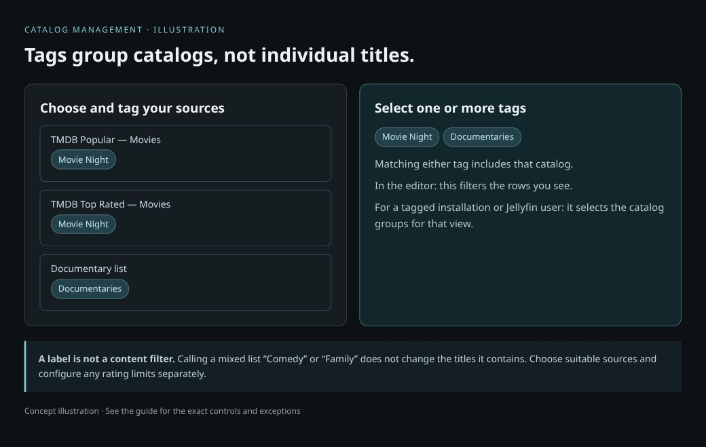

# Catalog Management Guide

Add the catalogs you want, keep their visibility under control, and use tags to organize them. Collections arrange those sources into a layout; [open the Collections guide](Collection-Builder-Guide.md) when you are ready.

## Quick start

1. Add a supported list through **Quick Add**, or create a filtered source with **Build Your Catalog**.
2. Keep the source **Enabled**. Turn **Home** on if you also want it shown as a normal home catalog.
3. Select catalog rows and use **Tag** to group them under a name such as `Movie Night`.
4. Save your AIO configuration. Open Collections when you want to arrange those sources into folders.

**Remember:** tags group catalogs. They do not create folders or turn a mixed list into a genre-filtered list.

## Catalog controls

**Catalogs decides what content is available. Collections decides how that content is organized.** A folder called “Comedy” does not automatically filter its contents to comedy: it needs a comedy catalog as its source.

### Which button should I use?

| In Catalogs | Use it when you want to… | How it relates to the builder |
|---|---|---|
| Quick Add | Add a supported list URL or custom manifest. | Makes the source available in your catalog configuration. |
| Build Your Catalog | Create a filtered discover catalog, such as recent comedy movies. | Defines the titles supplied by a folder or row. It does not create the folder layout. |
| Provider icons | Open source-specific integration settings. | Configure the provider or lists behind your sources. |
| Collections | Arrange sources into collections, folder tiles and Fusion rows. | Opens the builder covered in this guide. |
| Share Setup / Import Setup | Share or import the broader catalog setup. | Separate from the builder's layout-specific Import JSON and Export & share controls. |
| Reload Catalogs | Refresh the catalog view. | Useful when checking available catalogs; it does not import a layout into your viewing app. |

### Enabled is different from Home

| Control | What to keep in mind |
|---|---|
| Enabled (eye icon) | Controls whether the catalog is enabled. Keep a source enabled when you want to use it in your layout. |
| Home (house icon) | Controls whether the catalog is shown as a normal home catalog. It is separate from enabling the source. |
| Row checkbox | Selects catalogs for bulk actions. Checking it is not the same as enabling the catalog. |
| Drag handle / move arrows | Reorders the catalog list. The collection builder also has its own folder and source ordering. |
| Random order | Changes catalog ordering where supported; it does not shuffle your folder layout. |
| Delete Catalog | Removes a catalog from the configuration. A layout that references it may then need a replacement source. |

**Common setup:** keep a catalog **Enabled**, but turn **Home** off if you want to reach it through a collection rather than also showing it as a separate home row. The final display depends on how your client uses home catalogs and imported widgets.

### Read the Catalog Management list

Each row represents a catalog source, such as a movie list or a series discover catalog. Its name identifies the source; its media type tells you whether it supplies movies, series or anime. The same provider can supply several different catalogs.

Use search and filters to find rows, the row checkboxes to select them, and the available bulk actions to change the selected catalogs. **Filtering the screen does not disable the catalogs you cannot see.** Check the selection count before applying a bulk action.

The **Collections** filter offers **All**, **In a collection** and **Not in one**. Use it to find sources already referenced by your layout or sources you have not organized yet. This is separate from the Home switch: a source can belong to a collection and also appear as a normal home catalog.

## What are catalog tags?

A tag is a name you assign to one or more catalogs to group them, such as `Movie Night`, `Documentaries` or `To organize`. A catalog can have several tags, and catalogs from different providers can share one tag. The tag color is a visual aid.

**A tag describes the catalog group, not the titles inside it.** Naming a tag `Comedy` does not filter a mixed movie list to comedies. Use a suitable list or discover-catalog filters to choose the actual content. Catalog tags are also separate from provider content tags, such as AniList tags used in a discover search.

| Where you use a tag | What happens |
|---|---|
| Tags bar in Catalog Management | Filters the rows you see while editing. |
| Select by tag | Selects catalog rows for actions; selection is separate from visibility and enabling. |
| Tag action on selected catalogs | Applies or removes a tag on those catalogs. |
| Tag filters in the builder's catalog picker | Helps find tagged sources available to the builder. |
| Add sources by tag in a folder | Adds the matching available sources to that folder, skipping sources already attached. |
| Profile choices when installing | Builds an installation link for the selected tagged catalog groups. This is separate from exporting a collection layout. |

## Create and apply a tag

1. In **Catalog Management**, tick the checkboxes beside the catalogs you want to group. For example, select the movie versions of TMDB Popular and TMDB Top Rated.
2. Open the **Tag** action for the selection.
3. Under **Create a new tag**, enter `Movie Night`, choose a color if desired, and click **Add**. The new tag is applied to the selected catalogs immediately in the current configuration.
4. To reuse an existing tag, click it in the tag dialog instead of creating another. Tag names that differ only by capitalization are treated as the same tag.
5. Close the dialog, check the tags on the catalog rows, and save your AIO configuration to keep the changes on the server.

The tag dialog shows **Applied to all**, **Applied to some**, or **Not applied** for a selection. Clicking a partially applied tag adds it to the remaining selected catalogs. Clicking a tag already applied to all removes it from that selection.

## Filter, select and manage tags

Click a tag in the tags bar to filter the catalog list. Selecting several tags matches **any** selected tag: `Movie Night` plus `Documentaries` shows catalogs with either label. Other active filters, such as search or media type, still narrow the results. **Clear** in the tags bar clears the tag filter; it does not remove tags from catalogs.

The number beside a tag counts catalogs carrying that tag, not the movies or episodes inside them. It is not necessarily the number currently visible after other filters.

Open **Manage tags** to rename, recolor or delete a tag. Renaming updates its assignments throughout the current configuration. Deleting a tag removes the label and its assignments, not the catalogs themselves. Removing a tag from selected catalogs is narrower: other catalogs can keep it. Save the configuration after these changes. If you use a tag-specific installation link, review that profile and its link after renaming or deleting the tag.

## Use tags to build a collection faster

For the Movie Night example, first apply the `Movie Night` tag to the sources you want. Save the configuration, open the builder, and select a folder.

- To choose individual sources, open **Add catalog**, use the tag filter under **Your catalogs**, and select the sources you want.
- To attach the whole available group to one folder, use the folder's add-sources-by-tag option. Sources already in that folder are skipped.
- For separate tiles such as Popular Movies and Top Rated Movies, create separate folders and attach the corresponding source to each. Adding two sources by tag to one folder does not create two folder tiles.

**Adding by tag copies the current selection of sources into the folder. It is not a live rule.** Tagging another catalog later does not automatically add it to that folder. Repeat the add-by-tag action when you want to bring in newly tagged sources, then save and re-import the layout into your app.

Only tags covering sources available to the builder appear in its tag choices. If a tag is missing, confirm the catalogs are enabled, save your configuration and check the builder's source indicator.

## Tagged profiles and optional content ratings

For users connecting through a Jellyfin-compatible client, see [Jellyfin profile tags and accounts](Jellyfin-Guide.md#show-only-selected-catalog-tags). The installation profiles below are a different entry point.

The installation area's **Profile** choices let you select tagged catalog groups or **All catalogs**. Use the generated installation link for that choice. Clicking a tag in Catalog Management only filters the editor; it does not switch an existing app installation to that profile.

A tag can also have a **Content rating** in Manage tags, with a **Show unrated titles** option. This is an explicit profile setting; a tag named `Kids` or `Family` alone applies no rating limit. The rating setting is intended for installing that tagged profile and can tighten, but not loosen, the rating restriction saved in **Filters**.

When combining profiles with different limits, read the installation summary rather than assuming one uniform limit covers everything. Test the resulting catalogs and search, and decide whether unrated titles should be shown. Adding sources to a collection by tag is not the same action as installing a rating-limited profile.

## Common tag questions

| Question | Answer |
|---|---|
| Does a tag create a folder? | No. Create the folder in Collections, then attach sources. |
| Does clicking a tag enable its catalogs? | No. Filtering, selection and Enabled are different controls. |
| Why does a tagged catalog still appear on Home? | Tags do not change the Home switch. Adjust Home separately. |
| Why did selecting two tags show more catalogs? | Tag filters match either tag, rather than requiring both. |
| Why did a new tagged source not appear in my folder? | Adding sources by tag is a one-time action. Add it to the folder, save and re-import. |
| Does deleting a tag delete its catalogs? | No. It removes the label and assignments. |

## Example: make a source, then put it in a folder

Suppose you want a **Recent Comedies** tile inside **Movie Night**:

1. In **Catalogs**, use **Build Your Catalog** to create a movie discover catalog named `Recent Comedies`. Choose a supported provider and the genre/date filters you want. Available filters vary by provider.
2. Preview and build that catalog, then save the configuration. Provider access or API keys may be required.
3. Open **Collections**, select **Movie Night**, and add a folder named `Recent Comedies`.
4. Click **Add catalog**, find your new catalog under **Your catalogs**, select it, and add it.
5. Save the layout and re-import its export into your app.

Alternatively, use **Quick Add** to bring in an existing public list instead of creating a filtered catalog yourself.

## Where does the builder get its catalog list?

The header tells you whether catalogs were read from your **saved manifest** or derived from your **local config**. A saved manifest can provide genre options and requirements that the local draft does not have.

Featured imports can also carry definitions for missing catalogs. These are staged for addition when you apply/save; they are not all added just because you previewed the featured pack. The import summary shows the proposed additions and available capacity.

**Catalog missing from Add catalog?** Save the catalog configuration, confirm the source is enabled and its movie/series type is correct, then reopen the builder and check its source indicator. If needed, use **Change source** to inspect the manifest address. Use your own addon configuration. Creating a tile with the same name will not create the missing source.

