# AIO Metadata: Collection Builder Guide

A simple guide to organizing catalogs into collections and exporting them for Nuvio or Fusion.

**AIO Metadata v3.2.0 · Reviewed September 27, 2026.** Screenshots use a signed-out demonstration draft and public featured layouts. No personal account or addon links are included. The target apps' import screens are not shown; their menu names may vary by version.

## Start here

**New to collections?** Follow the [five-step quick start](#quick-start), then use the featured example or the manual walkthrough. **Already building?** Jump to [Catalogs and the builder](#catalogs-and-the-builder), [saving and exporting](#8-save-export-and-use-your-layout), or [troubleshooting](#10-quick-troubleshooting).

## Quick start

1. **Prepare a source.** In **Catalogs**, make sure the movie or show catalog you want is enabled. Save your AIO configuration.
2. **Open Collections.** Choose **Nuvio** or **Fusion** at the top.
3. **Create a layout.** Preview a **Featured** layout and import the parts you want, or create a collection with a folder and a catalog source.
4. **Check and save.** Confirm that every folder has its intended sources, resolve any save issues, then save.
5. **Use it in your app.** Export for your chosen app and import the file or supported link there. Saving in AIO alone does not update the app.

**Success check:** you can see your collection in the app, open a folder, and see titles from the catalog you selected.

## Catalogs and the builder

**Catalogs decides what content is available. Collections decides how that content is organized.** A folder called “Comedy” does not automatically filter its contents to comedy: it needs a comedy catalog as its source.

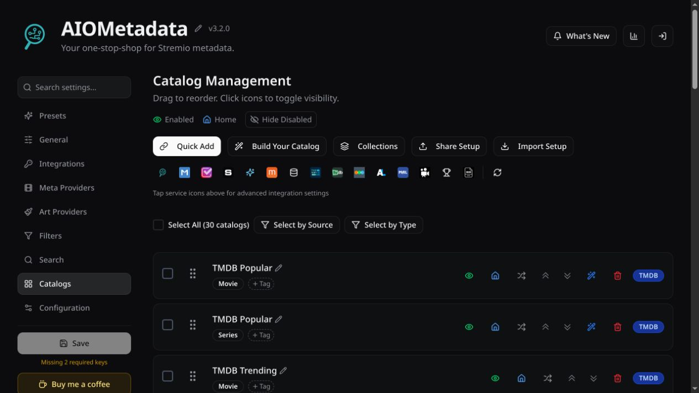

### Which button should I use?

| In Catalogs | Use it when you want to… | How it relates to the builder |
|---|---|---|
| Quick Add | Add a supported list URL or custom manifest. | Makes the source available in your catalog configuration. |
| Build Your Catalog | Create a filtered discover catalog, such as recent comedy movies. | Defines the titles supplied by a folder or row. It does not create the folder layout. |
| Provider icons | Open source-specific integration settings. | Configure the provider or lists behind your sources. |
| Collections | Arrange sources into collections, folder tiles and Fusion rows. | Opens the builder covered in this guide. |
| Share Setup / Import Setup | Share or import the broader catalog setup. | Separate from the builder's layout-specific Import JSON and Export & share controls. |
| Reload Catalogs | Refresh the catalog view. | Useful when checking available catalogs; it does not import a layout into your viewing app. |

### Enabled is different from Home

| Control | What to keep in mind |
|---|---|
| Enabled (eye icon) | Controls whether the catalog is enabled. Keep a source enabled when you want to use it in your layout. |
| Home (house icon) | Controls whether the catalog is shown as a normal home catalog. It is separate from enabling the source. |
| Row checkbox | Selects catalogs for bulk actions. Checking it is not the same as enabling the catalog. |
| Drag handle / move arrows | Reorders the catalog list. The collection builder also has its own folder and source ordering. |
| Random order | Changes catalog ordering where supported; it does not shuffle your folder layout. |
| Delete Catalog | Removes a catalog from the configuration. A layout that references it may then need a replacement source. |

**Common setup:** keep a catalog **Enabled**, but turn **Home** off if you want to reach it through a collection rather than also showing it as a separate home row. The final display depends on how your client uses home catalogs and imported widgets.

### Example: make a source, then put it in a folder

Suppose you want a **Recent Comedies** tile inside **Movie Night**:

1. In **Catalogs**, use **Build Your Catalog** to create a movie discover catalog named `Recent Comedies`. Choose a supported provider and the genre/date filters you want. Available filters vary by provider.
2. Preview and build that catalog, then save the configuration. Provider access or API keys may be required.
3. Open **Collections**, select **Movie Night**, and add a folder named `Recent Comedies`.
4. Click **Add catalog**, find your new catalog under **Your catalogs**, select it, and add it.
5. Save the layout and re-import its export into your app.

Alternatively, use **Quick Add** to bring in an existing public list instead of creating a filtered catalog yourself.

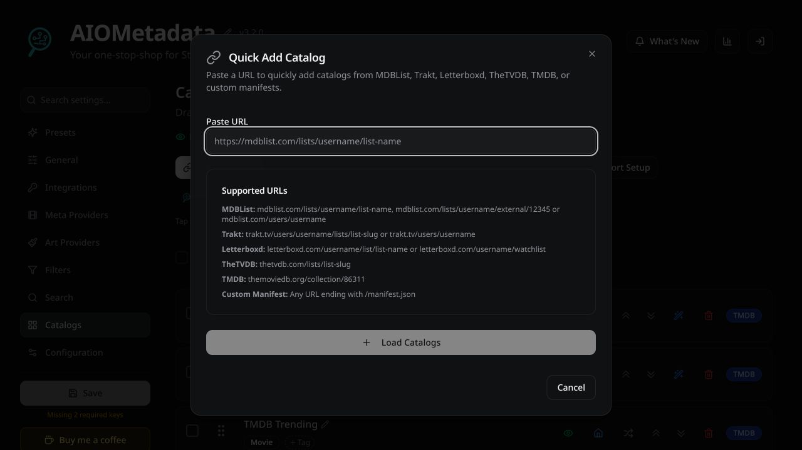

### Where does the builder get its catalog list?

The header tells you whether catalogs were read from your **saved manifest** or derived from your **local config**. A saved manifest can provide genre options and requirements that the local draft does not have.

Featured imports can also carry definitions for missing catalogs. These are staged for addition when you apply/save; they are not all added just because you previewed the featured pack. The import summary shows the proposed additions and available capacity.

**Catalog missing from Add catalog?** Save the catalog configuration, confirm the source is enabled and its movie/series type is correct, then reopen the builder and check its source indicator. If needed, use **Change source** to inspect the manifest address. Use your own addon configuration. Creating a tile with the same name will not create the missing source.

## 1. What are you building?

The builder arranges catalogs into a layout. The catalogs supply the movies and shows; the layout controls how people browse them.

| Term | What it means | Example |
|---|---|---|
| Catalog / source | A list that supplies titles. | TMDB Popular — Movie |
| Folder | A tile that opens one or more catalog sources. | Popular Movies |
| Collection | A named group of folders. | Movie Night |
| Row | A direct catalog row for Fusion, rather than a collection of folder tiles. | Trending Tonight |
| JSON | The file format used to move the layout into an app or another builder. You do not need to write it yourself. | Downloaded collection or widget file |
| Manifest | The addon description that tells the builder which catalogs and options are available. | Your saved AIO addon configuration |

A small first collection could be:

- **Movie Night** — the collection.
- **Popular Movies** — a folder using the TMDB Popular movie catalog.
- **Top Rated Movies** — a second folder using the TMDB Top Rated movie catalog.

A folder's cover is artwork for that folder, not the posters for every movie inside it.

## 2. Open the builder and choose your app

1. Open your AIO Metadata configuration and log into your saved setup.
2. Open **Catalogs**.
3. Click **Collections** to open **Collections & Widgets**.
4. Choose **Nuvio** or **Fusion** at the top, depending on where you will use the layout.

Use **Build** to edit a layout, **Featured** to browse ready-made examples, and **Export & share** when you are ready to use or share it.

| Feature | Nuvio | Fusion |
|---|---|---|
| Collections with folder tiles | Supported | Supported |
| Classic catalog rows | Omitted from export | Supported |
| Nuvio presentation and artwork settings | Used by Nuvio | Ignored by Fusion |
| Nested folders | Their catalogs are flattened into the parent folder on export | Their catalogs are flattened into the parent folder on export |

**Nested folders are labeled “Jellyfin only.”** The builder says Jellyfin clients can open them as folders within folders. This guide concentrates on the Nuvio and Fusion export workflow.

## 3. Easiest start: use a featured layout

Featured layouts provide ready-made folders, sources and artwork. You can preview them before importing anything.

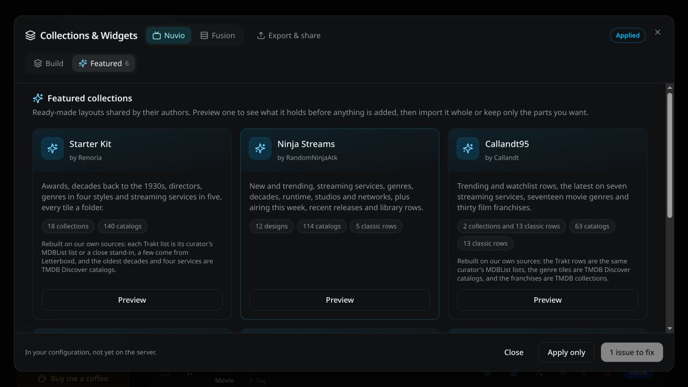

Examples available when this guide was written:

| Featured layout | What to expect |
|---|---|
| Starter Kit | Awards, decades, directors, genres and streaming services. |
| Ninja Streams | Trending titles, services, genres, decades, runtime, studios and networks. Includes classic rows. |
| Callandt95 | Trending/watchlist rows, services, movie genres and film franchises. |
| Snoak | Popular titles, discovery, service top tens, genres and decades. |
| TVGenie | Daily picks, movie/show categories, decades and networks. |
| Unified Media Experience | A larger selection of services, genres, people, studios, awards and lists. |

Some featured layouts use adapted sources. Read their description: an original Trakt list may have been replaced with an MDBList counterpart or another available source. Provider access and required keys still matter.

### Example: import only TVGenie's Movie Categories

1. Find **TVGenie** in **Featured**, then click **Preview**.
2. Click the entry names to inspect the different parts of the layout.
3. To keep only one part, click **None**, then tick **Import Movie Categories**.
4. Check that the button says **Import 1 of 3**, then click it.
5. Review the import summary and choose how to combine it with your current draft.

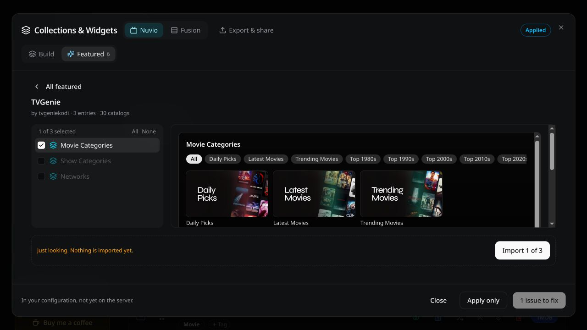

The selection checkbox controls **what gets imported**. Selecting an entry to preview it is a separate action.

| Import choice | What it does |
|---|---|
| Merge | Combines matching IDs and skips catalogs you already have. |
| Add as new | Keeps both copies rather than merging them. |
| Overwrite | Discards the existing builder design in favor of the imported one. Check carefully before choosing this. |

The summary may say catalogs are **rebuildable**. That means the file includes definitions for catalogs missing from your setup. The builder adds the needed ones when you apply/save. If you remove parts of the design first, only the remaining referenced catalogs need to be added.

**Start with one section.** Large featured packs can add many catalogs; you do not need to import the whole pack.

## 4. Understand the editor

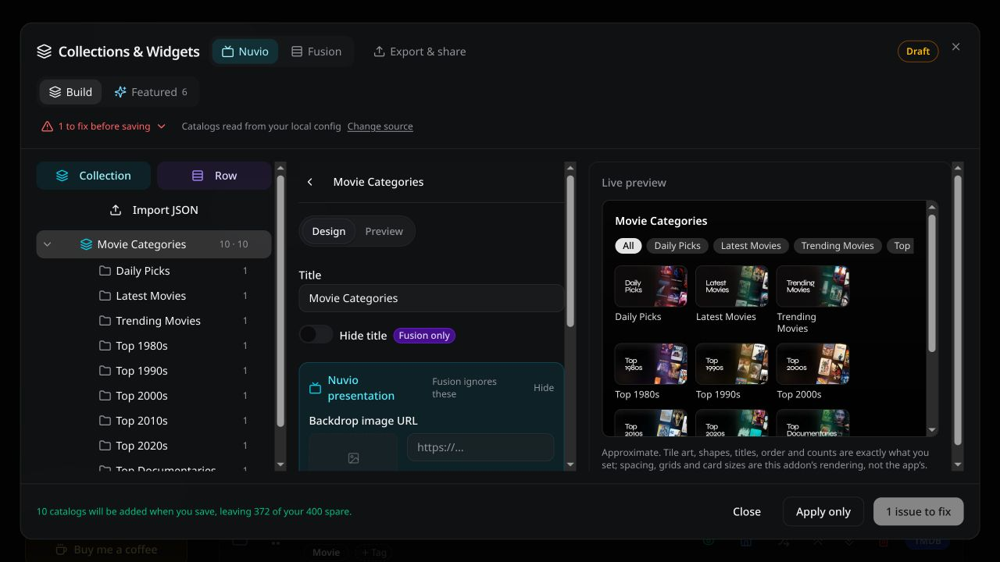

- **Left:** your collections and folders. Select an item to edit it. Use drag handles to change their order.
- **Middle:** settings for the selected collection, folder or row.
- **Right:** a live preview of the layout.
- **Design / Preview:** switch between editing and inspecting the selected entry.
- **Status and issue indicator:** show whether you have a draft and whether anything needs attention before saving.

The preview is approximate. It shows your artwork, shapes, titles and order, but spacing and card sizes can differ in the actual app. It is not a playback test.

The screenshots show **“1 issue to fix”** because the demonstration draft has no provider keys. In your setup, expand the issue indicator to read the actual reason.

## 5. Build your own collection

### A. Create the collection and first folder

1. Open **Build** and click **Collection**. In an empty builder you may also see **New collection**.
2. Set **Title** to `Movie Night`.
3. Click **Add folder**.
4. Set **Folder title** to `Popular Movies`.
5. Choose a tile shape: **Poster**, **Wide** or **Square**.

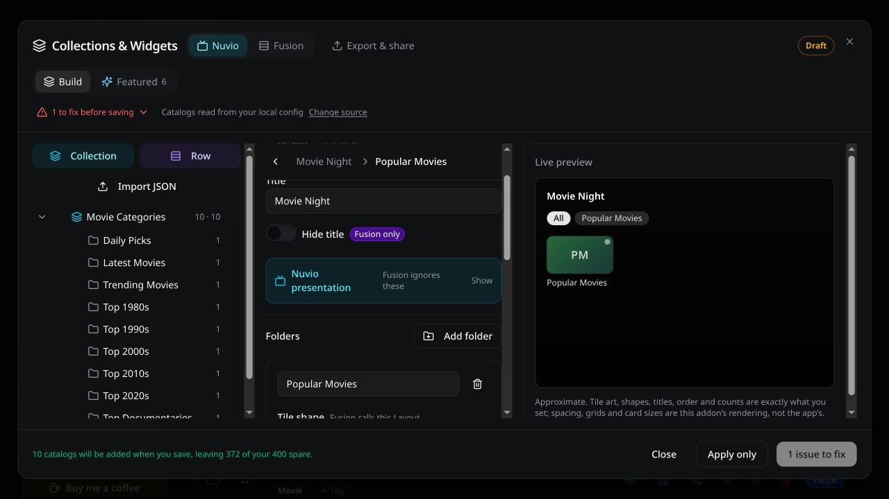

A new collection is not yet in your list until you click **Add collection**. **Discard** abandons that new entry.

### B. Give the folder a source

1. Click **Add catalog** in the folder's **Sources** section.
2. In **Your catalogs**, find **TMDB Popular** with type **movie**.
3. Tick it, then click **Add 1**.
4. Check that it appears under **Sources**.
5. Click **Add collection** when the new collection is ready.

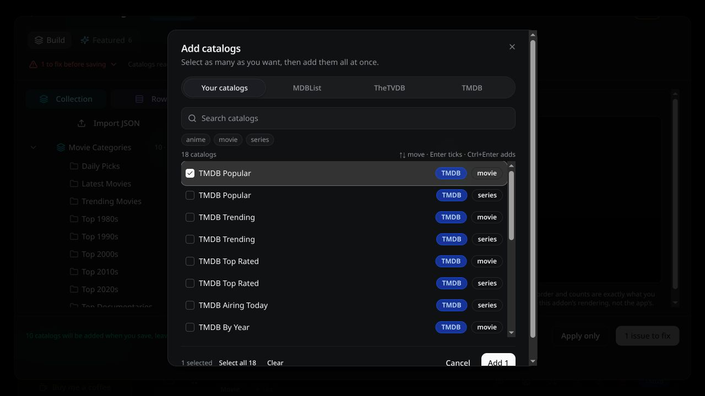

The picker lets you search, filter by media type and select several catalogs at once. There are also provider tabs for **MDBList**, **TheTVDB** and **TMDB**. Their available options depend on the source and your configuration.

Choose the correct media type: **TMDB Popular — movie** and **TMDB Popular — series** are different catalogs.

### C. Add a second folder

Select **Movie Night**, click **Add folder**, and repeat the process:

| Folder title | Catalog source | Suggested tile shape |
|---|---|---|
| Popular Movies | TMDB Popular — movie | Wide |
| Top Rated Movies | TMDB Top Rated — movie | Wide |

This is an example layout, not a required naming scheme. You can use your own lists instead.

**An empty folder can still export, but it opens empty.** Add at least one source if you want it to show titles.

## 6. Customize folders and collections

### Folder settings

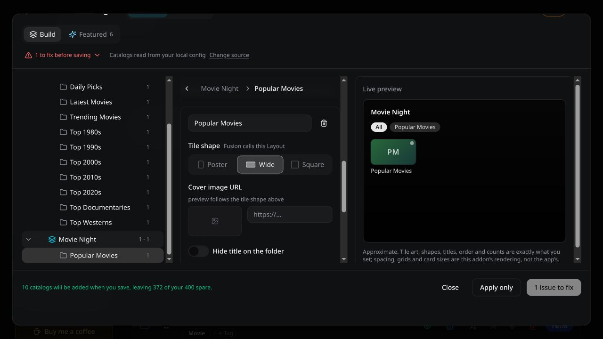

| Setting | What it changes |
|---|---|
| Folder title | The name of the tile. |
| Tile shape | Poster is tall, Wide is landscape, Square is square. Fusion calls this Layout. |
| Cover image URL | The artwork displayed on the folder tile. Use an image address your viewing device can reach. |
| Hide title on the folder | Hides the text label on that folder. Useful when the artwork already contains the name. |
| Sources / Add catalog | The catalogs opened by the folder. More than one can be attached. |
| Folders inside | Adds nested folders for Jellyfin; Nuvio/Fusion exports flatten their catalogs into the parent. |

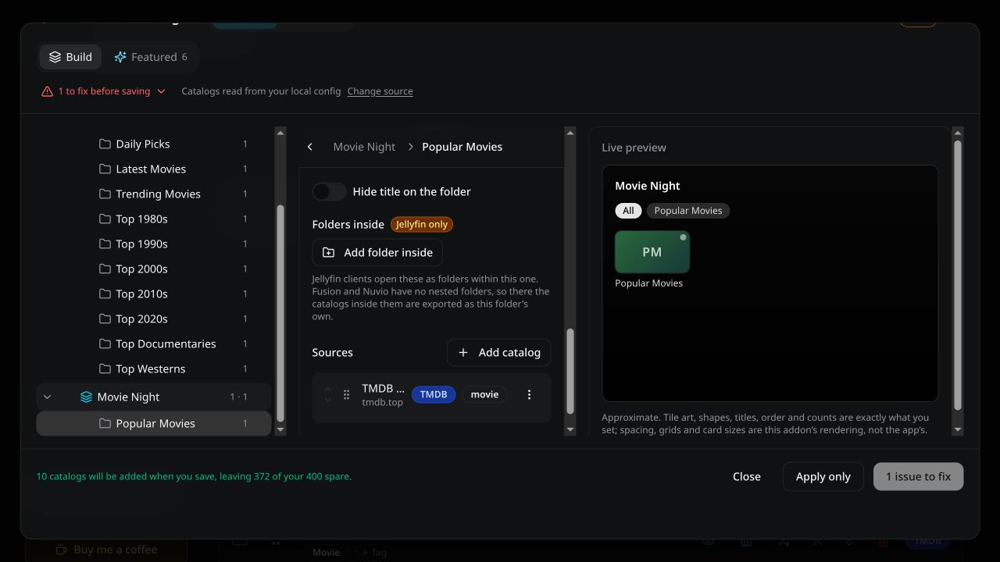

The catalog source supplies the contents; these controls arrange how it is attached to the folder. Use the source arrows or drag handles to change source order. Its actions menu includes **Rename catalog** and **Remove from folder**.

### Nuvio presentation

These collection controls are grouped under **Nuvio presentation**. Fusion ignores them.

| Setting | Purpose |
|---|---|
| Backdrop image URL | A background image for the collection. |
| Folder view mode | Choose Tabbed grid, Rows, or Follow layout. |
| Pin to top | Requests that the collection be pinned at the top in Nuvio. |
| Focus glow | Turns the focus glow on or off. |
| Show “All” tab | Controls whether the collection includes an All tab. |

**Show Nuvio artwork** opens optional folder artwork fields: **Cover emoji**, **Focus GIF URL**, **Hero backdrop URL**, **Hero video URL**, **Title logo URL**, and **Play focus GIF**. Leave them blank if you only want a simple tile. Their actual appearance depends on the app.

The collection-level **Hide title** control is labeled **Fusion only**. It is separate from hiding a folder's title.

## 7. Fusion example: a normal catalog row

Use a **Row** when you want a catalog displayed directly, instead of a tile that opens a folder.

1. Select **Fusion**, then click **Row**.
2. Name it `Trending Tonight`.
3. Click **Pick catalog** and choose your trending movie catalog.
4. Adjust **Items shown**, aspect ratio and card size.
5. Optionally enable numbered rankings or change badges.
6. Click **Add row**.

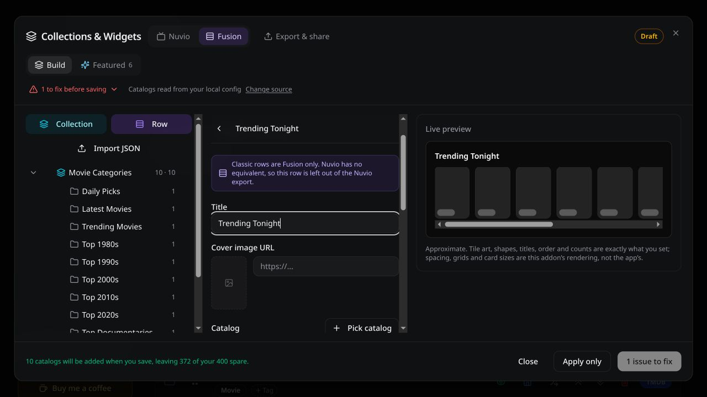

| Row setting | Meaning |
|---|---|
| Items shown | The item count requested for the row. |
| Cache TTL (seconds) | The row's cache duration setting. For example, 1800 seconds is 30 minutes. |
| Aspect ratio | Poster, Wide or Square cards. |
| Card size | The card-size preference for the row. |
| Numbered ranking | Adds 1, 2, 3… to the cards. |
| Hide title | Hides the row heading. |
| Provider badges / Rating badges | Controls those badges in the row. |

The screenshot is an unfinished row before its catalog is selected. **Fusion drops rows without a catalog. Nuvio omits classic rows entirely.**

## 8. Save, export and use your layout

There are two separate jobs: save the design in AIO, then import it into the viewing app.

1. Expand any **issues to fix** and resolve them.
2. Click **Save** to store the configuration on the server. **Apply only** keeps the design in the current configuration without saving it to the server.
3. Select the correct target: **Nuvio** or **Fusion**.
4. Open **Export & share**.
5. For your own app, leave **Make a copy for someone else** off. Use **Download** to get the JSON file, or use the import link if your app supports it.
6. In the target app, open its collection/widget import feature and import the file or supported link.
7. Check the layout and open a folder to verify that its sources load.

**Saving in AIO does not push the change into Nuvio or Fusion. You must import again to see later layout edits.** The saved-config import link is unavailable until you have saved a configuration.

### Updating an existing layout

- **Nuvio:** editing an imported collection preserves its ID, so re-importing updates the matching collection. Building a new collection creates a new ID and adds another collection.
- **Fusion:** importing adds widgets rather than matching existing ones. The builder advises removing the widgets you changed in Fusion, then importing only those replacements. They return at the end, so you may need to reorder them.

### Image caching

**Serve images through this server** makes exported artwork URLs use AIO's image cache. The original addresses in the editor remain unchanged. This may help with slow image hosts, but the viewing device must be able to reach your AIO server.

## 9. Share a layout without sharing your account link

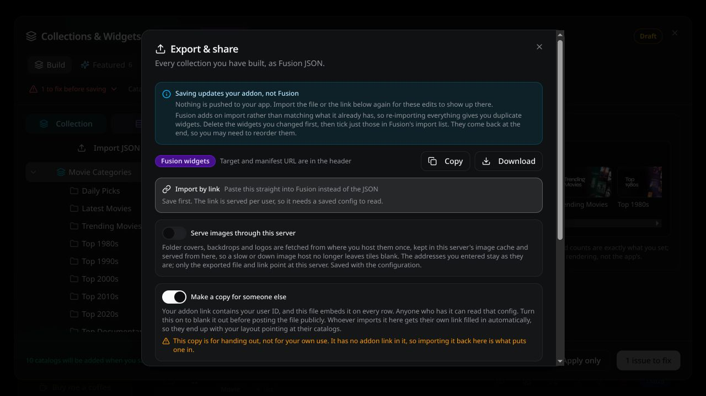

1. Open **Export & share**.
2. Turn on **Make a copy for someone else**.
3. Download that copy and review it for any private list names or custom image URLs you added.
4. Share the sanitized file, not your personal addon or import link.
5. The recipient opens **Import JSON** in their own AIO builder, then loads the file, pastes its contents or loads its link.
6. They review the import summary, save their own setup, and export a personal copy for their app.

The sharing switch removes the personal addon link. It does not mean that every custom name or external URL you typed is suitable for public sharing. A share copy is intended to be imported into the recipient's builder first so their own addon link can be filled in.

## 10. Quick troubleshooting

Start with the symptom below. When testing, change one thing at a time and check the same folder again.

### My folder is empty

1. In the builder, select the folder and check **Sources**. An empty tile can export successfully.
2. Confirm the catalog is enabled in **Catalogs** and has the correct media type.
3. Check the list/provider itself and any required access or filters. If the source has no titles, adding artwork will not fix it.
4. Save and re-import if you changed the source or layout.

### I saved, but nothing changed in my app

1. Check whether you clicked **Save** or only **Apply only**.
2. Export for the correct app and import it there again.
3. In Nuvio, edit the existing collection to preserve its ID. In Fusion, follow the replacement workflow to avoid duplicates.

### I cannot save or cannot see a genre option

Expand the issue indicator. Resolve the specific problem it names, such as missing provider keys or capacity. If the builder is using a local draft, save the main configuration so it can read the real manifest. Do not paste somebody else's private manifest link to work around this.

### My artwork is blank

Check the cover URL first: it should point to an image the viewing device can reach. A successful browser preview on one device does not prove another device can reach a private server. If using **Serve images through this server**, check that the app can reach AIO too.

### More symptoms

| Problem | What to check |
|---|---|
| Folder opens empty | Does it have a catalog source? Is that source enabled and working in AIO? |
| New collection is missing from the list | Did you click Add collection after creating it? |
| Save is disabled | Expand the issue indicator. Check missing provider keys, required configuration and catalog limits. |
| Catalog or genre options are missing | Check the catalog source. A saved manifest provides details that a local draft may not contain. |
| Source is wrong or unavailable | Use Change source to inspect the manifest URL; use your own configuration, not somebody else's private addon link. |
| App still shows the old design | Save, then re-import the export into the app. |
| Fusion has duplicate widgets | Re-import only the changed replacements, following the update guidance above. |
| Nuvio is missing a classic row | Classic rows are Fusion-only. Use a collection with folders for Nuvio. |
| Artwork is missing | Check the image URL and whether the device can reach it; consider server image caching. |
| Preview looks different from the app | The builder preview is approximate. Test the exported layout in the target app. |

**A good first setup:** one collection, two folders, one source per folder. Once that works in your app, add more sections or adapt a featured layout.

---

Featured examples and artwork belong to their respective creators. The TVGenie example shown here is credited in the builder to tvgeniekodi. This guide documents the observed builder interface; it does not claim that an import was tested inside Nuvio or Fusion.
