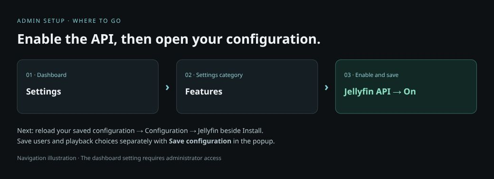
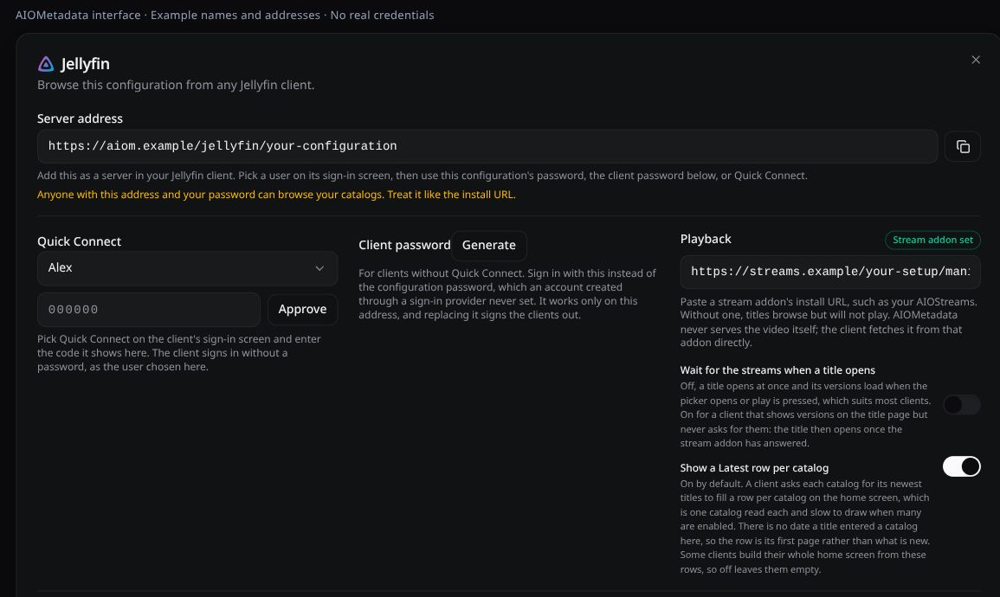
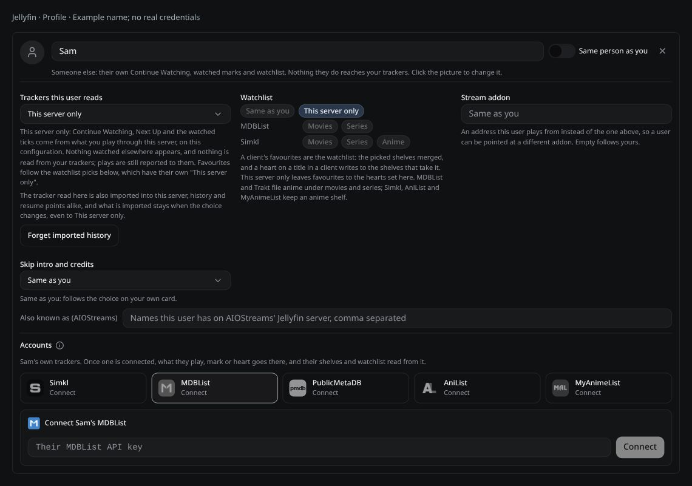
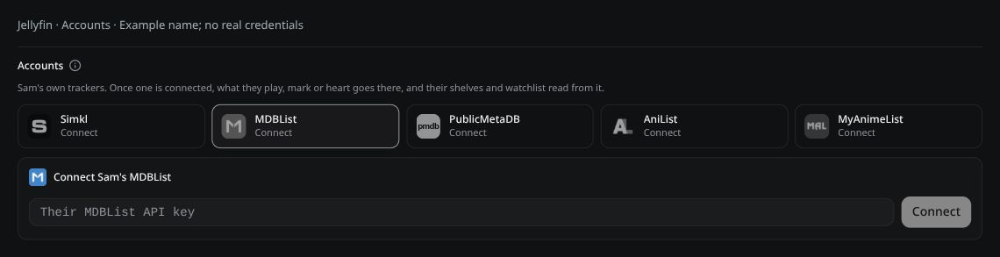
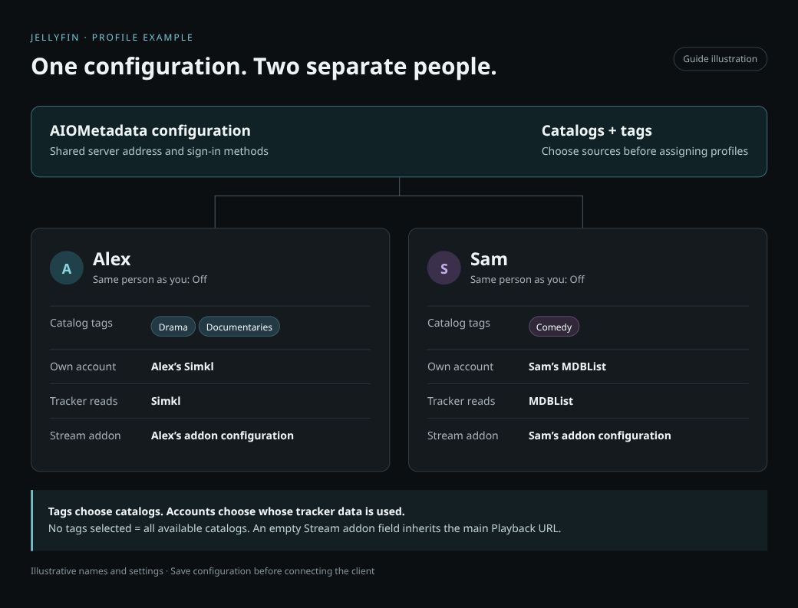

# Jellyfin & Profiles

Use AIOMetadata as a server in a Jellyfin-compatible app, with separate users, catalog selections and playback sources. You do not need to install a separate Jellyfin server for this connection.

The popup calls profiles **Users**: they are viewing profiles within one saved AIOMetadata configuration, not separate AIOMetadata logins. Client support and available controls depend on your versions.

**Visuals:** click any image to enlarge it. Interface captures use example names and addresses; the diagrams illustrate setup choices.

## Quick start

1. **Admin:** open **Dashboard → Settings → Features**, enable **Jellyfin API**, and save the dashboard settings.
2. Open your saved AIOMetadata configuration. Refresh it if it was already open. Open the **Configuration** section and click **Jellyfin** beside the install controls.
3. Under **Playback**, paste your stream addon's installation URL if you want to play titles.
4. Keep the main user for a single-person setup, or add users as needed. Click **Save configuration** in the popup.
5. Copy **Server address** into your app's Add Server screen. Choose the user and sign in using Quick Connect, a client password, or your configuration password.

**Two different saves:** dashboard settings enable the feature for the server. **Save configuration** saves your users, playback source and profile choices.

## Enable the Jellyfin API

Only the server admin can enable **Jellyfin API** in the dashboard's **Settings → Features** section. Search the settings for `Jellyfin` if you cannot find it. Its environment-variable name is `JELLYFIN_API_ENABLED`.

Save the dashboard change, then reload the configuration page. Load your saved configuration, open **Configuration**, and look for **Jellyfin** beside **Install**. If you use someone else's instance, ask its admin to enable the feature.

This exposes your AIOMetadata catalogs through a Jellyfin-compatible API. It does not create a local video library or provide transcoding. AIOMetadata gets playback links from your chosen stream addon; the player fetches the video directly.

## Connect your app

Use the **Server address** shown in the Jellyfin popup, including its full path. Do not substitute the dashboard address or a Stremio manifest link. The address must be reachable from the device running your app.

| Section | What to do |
|---|---|
| Server address | Copy it into the client's Add Server field. This address belongs to your saved configuration. |
| Quick Connect | In the client, choose Quick Connect. In this popup, select the intended user, enter the client's six-digit code and click Approve. |
| Client password | Generate a password for clients without Quick Connect, save the configuration, then use it at the client's sign-in screen. Replacing it signs clients out. |
| Configuration password | An alternative sign-in method if your configuration has a password. Accounts created with a sign-in provider may need Quick Connect or a generated client password instead. |

**Keep the address and passwords private.** Profiles share this configuration's sign-in methods; adding a user does not create a separate password for that person. Pick the correct user in the client, or choose it when approving Quick Connect. If the client asks for a username instead of showing user cards, enter the name from that user's card.

## Set up playback

Paste a stream addon's **installation URL** into **Playback**, such as the configured manifest URL from AIOStreams. Save the configuration. A user needs either this shared playback source or a Stream addon override on their card to play titles. Without either, they can only browse.

| Control | When to use it |
|---|---|
| Wait for the streams when a title opens | Leave off for clients that request versions when opening the picker or pressing Play. Turn on if your client expects versions on the title page but never requests them separately. Opening a title then waits for the addon response. The server may enforce this setting. |
| Show a Latest row per catalog | Normally on. Each row requires a catalog read. With many catalogs this can slow home loading; turning it off can leave clients that rely on these rows with an empty home screen. These rows show each catalog's first page, not necessarily newly added titles. |

### Give a profile a different stream addon

1. Add the user under **Users**, or find their existing card.
2. Paste that user's configured addon installation URL into their **Stream addon** field.
3. Click **Save configuration** and use that profile in your client.

An empty **Stream addon** field inherits the main **Playback** URL. A filled field replaces it for that user; it does not combine the two addons. For example, `Alex` can use one AIOStreams configuration and `Sam` another. Configure the accounts and services inside each stream addon separately.

## Add a user

1. Under **Users**, enter a unique **New user name** and click **Add user**.
2. Decide whether this is another view for you or a different person using the choices below.
3. Choose catalog tags, accounts, tracker and watchlist options as needed.
4. Click **Save configuration**. Select that user when connecting the client.

The main user already exists and is marked **You**. Add another user only when you need a different person or a different view. Click a user's picture to provide an image URL. Use distinct names; names are matched without regard to capitalization.

| Who is this profile for? | Same person as you | Result |
|---|---|---|
| You, with a different catalog selection | On | Shares your Continue Watching, watched marks and tracker writes. Catalog tags, stream addon and source choices can still differ. |
| Another person with their own trackers | Off | Connect their accounts on their card. Their supported personal shelves, watchlist and tracking use those accounts. Services they have not connected do not fall back to your accounts within these supported integrations. |
| Another person using local history only | Off | Choose This server only for tracker reads and watchlist, and leave their accounts disconnected. Their plays are remembered separately on this server. |

**Separate catalogs do not mean separate history.** Leave **Same person as you** off for another person. A user with their own accounts cannot enable that switch until those accounts are disconnected.

**For a local-only user, explicitly choose This server only.** Turning off **Same person as you** separates locally recorded history and stops writes to your trackers, but a user with no accounts of their own can still inherit your tracker-read choices. Check both the tracker and Watchlist choices rather than assuming the switch disables all external reads.

## Connect different accounts and trackers

For your main user, connect services through the configuration's normal integrations. For another person, leave **Same person as you** off and use **Accounts** on their user card.

1. Click the service you want to connect on that person's card.
2. Complete its sign-in flow using **their** account, or enter their API key when requested. Check the connected account name before continuing.
3. Check **Watch tracking** and the **Movies / Series** switches for that service.
4. Choose the tracker source and watchlist shelves for this user, then save the configuration.

The current user-card integrations are **Simkl, MDBList, PublicMetaDB, AniList and MyAnimeList**. Service availability and options may differ on older builds. If a browser is already signed into your account at a provider, switch accounts before approving someone else's connection.

**Accounts do not replace every catalog's owner.** Supported personal shelves use the connected user's accounts, but public or explicitly named lists keep their selected source. Other services, such as Trakt or TMDB, can still show the main configuration's lists if their catalogs are included by the user's tags. Review those tags when setting up another person.

If the service offers **Add … watchlist to the catalogs**, use it to add the missing personal shelf. Apply the user's catalog tag to that source if the profile filters by tags. PublicMetaDB uses the main configuration's PublicMetaDB watchlist catalog as the slot for the other account's own watchlist.

### Tracker reads versus tracker writes

The **Your trackers / Their trackers / Trackers this user reads** selector chooses where AIOMetadata reads history. Watch tracking controls whether playback is reported back to connected services. These are different settings.

| Choice | What it means |
|---|---|
| Same as you | Follows the main user's source choice where offered. It does not by itself turn a separate user into the same person. |
| Automatic | Merges paused titles from connected position-capable trackers. Watched marks, Next Up and Upcoming use the first available source in the order MDBList, Simkl, PublicMetaDB. |
| A named tracker | Uses that source alongside activity recorded through this server. Useful when trackers disagree. |
| AniList or MyAnimeList, where offered | Reads anime list progress. They do not supply playback positions, so Continue Watching comes from pauses recorded here. |
| This server only | Stops external history reads. It does **not** turn off reporting plays to connected trackers. Disable Watch tracking for those services if that is also your intention; this also removes them from eligible tracker-read choices. |

**AniList / MyAnimeList limitation:** the main user's selector can offer these anime sources, but this reviewed build only offers MDBList, Simkl and PublicMetaDB as explicit sources for users with their own accounts. Connecting AniList or MyAnimeList for a separate user does not make it appear in that dropdown. Their account can still support tracking and anime watchlist shelves.

Plays recorded through this server take precedence over imported tracker state for the same title. The general **Watch Tracking** settings determine when playback is recorded, across users.

### Watchlist and favourites

The **Watchlist** choices control the client's favourites separately from history. Select the relevant movie, series or anime shelves, use **Every connected**, or inherit **Same as you** where offered. In clients that use favourites as the watchlist, a heart writes to the selected shelves that support the title. Pelagica has separate watchlist and favourite controls, so those actions are handled separately.

**This server only** under Watchlist keeps favourites local. Changing the tracker-history selector does not change this watchlist choice. PublicMetaDB needs a watchlist list on the connected account to offer that shelf.

### Forget imported history

Changing your tracker source does not erase history already imported from it. **Forget imported history** removes imported watches and resume points for the selected user, while keeping plays and marks made through this server. It does not erase the tracker account's own history.

If a tracker is still selected, its history can return on the next sync. Choose the intended source first; use this action only when you actually want to clear prior imports.

## Show only selected catalog tags

1. Open **Catalogs** and apply a tag, such as `Family`, to the catalog sources you want this user to see. Keep those catalogs enabled. See [create and apply a tag](Catalog-Management-Guide.md#create-and-apply-a-tag).
2. Open **Jellyfin**, find the user's card and select that tag under **Tags**.
3. Save the configuration and refresh the client; reconnect if it keeps an old library listing.

**No tags selected means every available catalog, not zero catalogs.** Selecting several tags includes catalogs carrying **any** of them. `Family` plus `Documentaries` includes both groups; a catalog does not need both labels.

Tags select catalog sources. They do not filter individual titles by genre or automatically make a mixed list suitable for children. Configured tag rating limits also apply, but review your actual sources and results. These profiles share sign-in methods, so tags are not separate-password parental controls.

### Example: two people, two setups

| Setting | Alex | Sam |
|---|---|---|
| Same person as you | Off | Off |
| Tags | Drama, Documentaries | Comedy |
| Accounts | Alex's Simkl account | Sam's MDBList account |
| Tracker source | Simkl | MDBList |
| Watchlist | Simkl Movies and Series | MDBList Movies and Series |
| Stream addon | Alex's configured addon URL | Sam's configured addon URL |

Create these catalog tags first, then configure each card and save. These are example names and choices, not preset profiles. To create another view for yourself instead, turn **Same person as you** on and select its catalog tags.

## Other user controls

| Control | What it does |
|---|---|
| Skip intro and credits | Chooses skip-marker sources. Automatic uses available sources; explicit choices include PublicMetaDB, AniSkip and IntroDB. Off supplies no markers. The client must support skip buttons. |
| Also known as (AIOStreams) | Appears when playback reporting is enabled. Enter that person's AIOStreams Jellyfin names for reporting handoff. Each name or alias must identify only one user. This is not a stream-addon URL. |
| Remove user | Removes the profile from the configuration and disconnects its connected accounts. Check the selected user before confirming. |

AniSkip supplies anime markers without a key. IntroDB also needs no key; lookups send title and episode information to the service. PublicMetaDB uses its configured key. Availability of a marker does not guarantee that a client displays a skip button.

## Troubleshooting

| Problem | Check this first |
|---|---|
| No Jellyfin button | Confirm Jellyfin API is enabled by the admin, reload the configuration page and load your saved configuration. Older builds may lack some profile controls. |
| Server does not connect | Copy the complete Server address from the popup. Check that the player can reach that host; a local address may only work on your network. |
| Sign-in fails | Save newly generated client passwords and users first. Choose the correct user. Quick Connect needs the current six-digit code from that client. |
| Browsing works, playback does not | Check the main Playback URL and the user's Stream addon override. Test that configured stream addon independently. |
| Wrong person's progress | Check the signed-in profile, Same person as you, connected account names and tracker-read source. |
| Old watched marks remain | Changing the source keeps existing imports. Review Forget imported history above. |
| A tracker or shelf is missing | Connect the service and enable tracking for it. PublicMetaDB also needs its watchlist list. Not every tracker supports playback positions or every media type. |
| Too many catalogs | No selected tags means all catalogs. Pick the desired tags and check their assignments in Catalogs. |
| A tagged catalog is missing | Confirm it is enabled and has a selected tag. Personal shelves also require the relevant account. Search-only catalogs are not ordinary browsable libraries. |
| Changes do not show | Click Save configuration in the popup, then refresh or reconnect the client to replace its cached view. |
| Home screen is empty | Check Show a Latest row per catalog; some clients build their home screen from those rows. |

Checked against AIOMetadata testing build `0.0.0-testing.20261002.5`. Older stable releases may not have all of these controls. If a control is absent, compare your installed version before changing unrelated settings.
